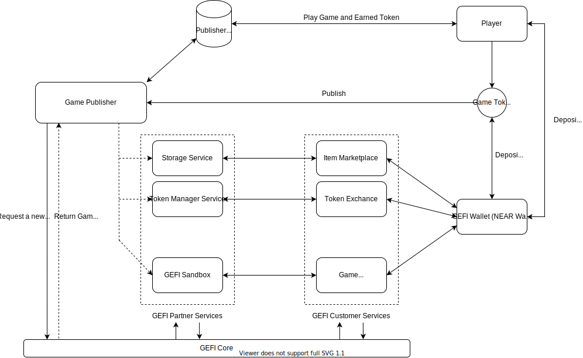
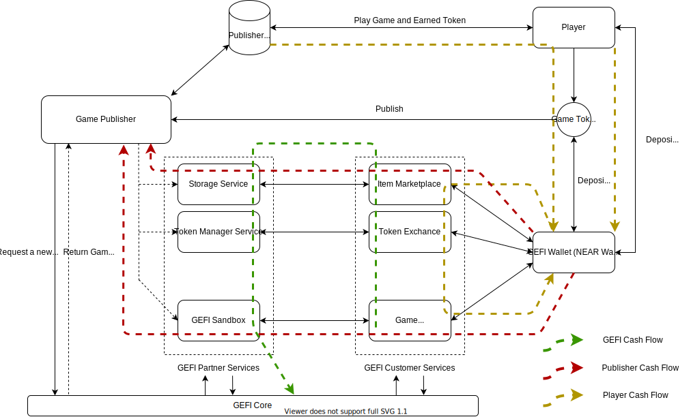

# GeFi Hub

Online games are currently the most popular and popular form of entertainment today. We play games after hard working hours, we choose games when we feel bored, and don't know what to do during the days of social distancing or work-from-home due to the Covid epidemic. Not only helps relieve stress, but games are also a means to help people connect and get closer to each other. Therefore, games are an indispensable part of life.

Moreover, games are not only a form of entertainment but also a means of increasing the income of many gamers today. They play games, exchange items, and convert to money. However, all transactions are spontaneous, with no guarantee of authenticity.
Therefore, we introduce a project that is both entertaining and helps gamers easily convert in-game items and money into NEAR tokens.

```At this time```, our platform will help the game publishers implement their games with the blockchain network. Centralized games have billions of players over the world, most of them can not bring their token in-game to reality, to deal with this problem, we provide a platform that helps players can swap their in-game tokens with a cryptocurrency like NEAR, ETH, or other game tokens on our network.

Each user can have their wallet where they can trade, donate, join a bet or get profit with their in-game tokens by swapping with a cryptocurrency and stake them. Moreover, because all transactions are performed on the blockchain network, everything is transparent, private, and has no scam. That's so exciting!

In the future, GeFi will not only support games, but also all products with payment integration.

## System Architechture


In bassically, GeFi hub have 4 block:

1. ```GeFi Space Management```: This block will store all spaces of producer. Each space can be considered as an independent company. The companies are all in different industries and offer distinct products.

2. ```GeFi Token Management```: This block will store all kind of digital token of producer. Token can be use across from all producer space. That mean, Token(1) of producer A can be swapped to Token(2) of Producer B in a liquidity pool. Further, token also can be swapped to NEAR (GeFi NEP-141)

3. ```GeFi Product Management```: All products of producer will be stored in this block. Each product will belong to a certain producer ```space``` and using one ```token``` for make a payments. At the time of create ```token```, producer need to deposit the amount of NEAR and provide a value of token's volume. The rate between NEAR and ```token``` will be caculated, and be modified by time. We plan to make a DAO for voting the rate by governance in the furture.

4. ```GeFi User Management```: We develop a block to centrally manage tokens of all clients participating in GeFi. From there, an application similar to an e-wallet will be created and directly interact with this block in the future.

## GeFi Bussiness model



Our Platform has two types of customers

1. Producers

    When producers publishing their product ```(game)``` on GeFi, publishers have to register the token for that game.

    Token will be synchronized with their in-game token, they can earn tokens for the player, and on another side, the player can trade their token to play the game or get money through swapping with cryptocurrency like NEAR, ETH, and so on.

    Producers can store in-game datas like user tokens, user information, or something else as them want. GeFi will not interfere deeply with the organization of the product.

    For some potential provider, Sandbox is our impression feature, where the new game publisher can raise the fund to perform their dream game

2. Clients / Players.

    To using any products in GeFi Platform, clients need to deposit the amount of ```NEAR``` then swap them to ```in-game Token``` respectively. A wallet will help the client to store whole their tokens in any product as the deposit before. Thus, It will help players easier to swap with other in-game tokens on the GeFi platform, connect with GeFi Player Services, and some other interesting services.

    Additionaly, NFT is a trend right now. So GeFi also has multiple plans to apply it. An ```item Marketplace``` for example, where the player can buy the beautiful avatar or other NFT products from third party. It can become a potential investment channel.

    They also can trade their in-game tokens on ```Token Exchange``` or try to become an investor with ```Game Crowdfunding```.

## GeFi Cash Flow



Start with the player, they can be earned tokens from publishers by play games, trade tokens, or NFT on the marketplace and token exchange and get profit from Crowdfunding services.

Publishers can get money by their token value, create and sell the NFT asset or raise the fund from the community through the Sandbox with the startup game studios.

With GEFI, we collect the transaction fee on our system, publish the NEP-141 called GEFI, and the other comes from our services.

## GeFi Interface

### Space Hub

- Each owner can have multiple spaces (company, co.op, ...). Example: You establish a game building company, a logistics company or whatever else you want. Each company will have its own number of products

- Space will be storage in ```PersistentUnorderedMap``` to get the maximum performance during ```get``` and ```set```

    ```typescript
    type space_name = String;

    class Space {
        public owner: String;
        public name: String;
        public symbol: String;
        public icon: String
    }

    const gefi_Spaces = PersistentUnorderedMap<space_name, Space>("gSp");
    ```

- Space public user interface
  
1. Register new space to system

    ```typescript
    /**
     * Each owner can register multiple spaces, but them need to have a unique name
     * @param:
     * name: Unique of space
     * symbol: The symbol of space
     * icon: The icon of space in base64
     * @return
     * a new space or null if it exists
    **/
    function sp_register(name: String, symbol: String, icon: String): Space | null {}
    ```

1. Unregister all space of owner

    ```typescript
    /**
     * @param:
     * @return:
     * return all spaces of owner or null if the owner does not have any spaces
    **/
    function sp_unregisters(): Space[] | null {}
    ```

1. Unregister a space of owner

    ```typescript
    /**
     * @param:
     * name: Space name need to be unregister
     * @return:
     * return a deleted space or null if it is not exist
    **/
    function sp_unregister(name: String): Space | null {}
    ```

1. Update space detail

    ```typescript
    /**
     * @param:
     * name: Name of space need to be updated
     * symbol: new symbol of space
     * icon: new icon of space
     * @return
     * true if space updated otherwise false
    **/
    function sp_update(name: String, symbol: String, icon: String): bool {}
    ```

### Token Hub

- Each owner can have multiple tokens at multiple rates. Owners can use tokens for multiple products or one token for all products. It depends on the needs of the owner.
- Token will be storage in ```PersistentUnorderedMap``` to get the maximum performance during ```get``` and ```set```

    ```typescript
    type token_name = String;

    class Token {
        public owner: String;
        public name: String;
        public symbol: String;
        public icon: String
        public rate: f64; // rate = token/near
        public balance: u128 = u128.Zero;
        public near_balance: u128 = u128.Zero; // For MVP product only
        private P: u128; // For MVP product only
    }

    const gefi_Tokens = new PersistentUnorderedMap<token_name, Token>("gtk");
    ```

1. Register new token to system.

    ```js
    /**
     * @param:
     * name: Name of token need to be uniqe
     * symbol: The symbol of token
     * icon: The icon of token
     * @return
     * return the created token or null if it exists
     **/
    function tk_register(name: String, symbol: String, icon: String): Token | null {}
    ```

1. Unregister all token

    ```js
    /**
     * @param 
     * @return
     * return all unregistered tokens or null if owner does not have any tokens
     **/
    export function tk_unregisters(): Token[] | null {}
    ```

1. Unregister a specific token

    ```js
    /**
     * @param
     * name: Name of token that need to be unregistered
     * @return
     * return the unregistered token or null if it is not exists
    **/
    export function tk_unregister(name: String): Token | null {}
    ```

1. Update token detail

    ```js
    /**
     * @param
     * name: Name of the token that need to be updated
     * symbol: new symbol of token
     * icon: new icon of token
     * @return
     * return trur if the token updated otherwise false
    **/
    function tk_update(name: String, symbol: String, icon: String): bool {}
    ```

1. Get the token rate

    ```js
    /**
     * @param
     * ownerId: ownerid of the token
     * name: name of token
     * @return
     * return the rate token/near
    **/
    function get_rate(ownerId: String, name: String): f64 {}
    ```

1. Swap from ```in-game Token``` to ```NEAR```

```typescript
/**
 * @param
 * ownerId
**/
export function buy_near(ownerId: String, name: String, amount: u128): ContractPromiseBatch | null {}
```


export function buy_token(ownerId: String, name: String): ContractPromise | null {
    return token.buy_token(ownerId, name);
}
### Product Hub

- Each owner can have multiple product as described above. A product can be a game, a music stream or anything else, needs to belong to a certain space and own a token for it.
- Product will be storage in ```PersistentUnorderedMap``` to get the maximum performance during ```get``` and ```set```

    ```typescript
    type product_name = String;

    class Token {
        public name: String;
        public symbol: String;
        public icon: String
        public space: Space;
        public token: Token;
    }

    const gefi_Products = new PersistentUnorderedMap<product_name, Product>("gGm");
    ```

1. Register new product to space and assign token

    ```typescript
    /**
     * @param
     * name: Name of product need to be uniqe
     * symbol: symbol of product
     * icon: icon of product
     * space: space will contain the product
     * token: token will be used in the product
     * @return
     * return the registered product or null if space or token could not be found or product exists
    **/
    export function gm_register(name: String, symbol: String, icon: String, space: String, token: String): : Product | null {
    }
    ```

1. Unregister all products

    ```typescript
    /**
     * @param
     * space: Space name need to unregister all product
     * @return
     * return all unregistered product or null if the space does not have any product
    **/
    export function gm_unregisters(space: String): Product[] | null {}
    ```

1. Unregister a certain product

    ```typescript
    /**
     * @param
     * space: Space of product
     * name: Name of product that need to be unregistered
     * @return
     * the unregisterd product or null if it is not exist
    **/
    export function gm_unregister(space: String, name: String): Product | null {}
    ```

1. Update product detail

    ```typescript
    /**
     * @param:
     * space: Space of product that need to be updated
     * name: Name of product that need to be updated
     * symbol: new symbol of product
     * icon: new icon of product
    **/
    export function gm_update(space: String, name: String, symbol: String, icon: String): bool {}
    ```
